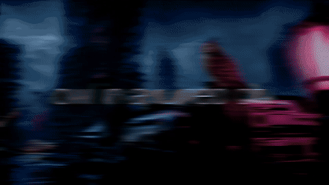

# Owl in a Ruined City

A 19-second, single-shot AI film built from one still image. I planned, generated, graded and cut it solo using an open-weights video model in ComfyUI.



**Full video:** [`owl_in_a_ruined_city.mp4`](owl_in_a_ruined_city.mp4) (1920×1080, 24 fps) · **Write-up:** [vinnayakk.com](https://www.vinnayakk.com/projects/owl-in-a-ruined-city)

## The problem

Image-to-video models generate about 5 seconds per pass (81 frames for Wan 2.2). The brief called for one continuous shot three to four times that long: a slow dolly right, with the subject and rain held steady, and the owl turning its head only at the end. Across several generations, the camera, the lighting and the owl each tend to drift.

## Pipeline

```
Hero still ──► Wan 2.2 I2V 14B (chunk 1) ──► last frame ──► chunk 2 ──► chunk 3 ──► chunk 4
                                                                                       │
             DaVinci Resolve (edit, grade, 3-layer sound) ◄── ESRGAN upscale ◄── RIFE 16→48 fps
```

1. **Hero still.** I generated the source image first. A FLUX.1 Schnell version gave softer edges and weaker depth cues, and the video model drifted more from it. The final still gave the model a much stronger start (`still-comparison.jpg`).
2. **Four chained generations.** Each chunk starts from the last frame of the previous one (`Part1`–`Part4` in this repo), using [Wan 2.2 I2V-A14B](https://huggingface.co/Comfy-Org/Wan_2.2_ComfyUI_Repackaged) (fp8, Apache 2.0) on a rented RTX 4090.
3. **Prompt locking.** Subject, camera and environment clauses were repeated word for word in every chunk, and only the action line changed. The head turn appears only in the final chunk's prompt, because the model tends to add head movement on its own.
4. **Frame interpolation and upscaling.** RIFE 4.9 takes the footage from 16 to 48 fps, and ESRGAN upscales it to 1080p. These ran as separate ComfyUI passes, exported as ProRes.
5. **Edit and sound.** Cut, graded and mixed in DaVinci Resolve, with three sound layers: rain, cloth in the wind, and an electrical hum.

## Results

- 19 seconds of continuous footage from four 5-second generations.
- Chunk 1 took about a dozen attempts. The failures were camera drift, a zoom where a dolly was asked for, unwanted head turns, and missing rain.
- **Main lesson:** the quality of the start frame mattered more than prompt wording. Image-to-video models condition heavily on the first frame.

## Files

| File | What it is |
|---|---|
| `wan22_14B_i2v.json` | ComfyUI workflow for the image-to-video chunks |
| `upscale_interpolation_v2.json` | ComfyUI workflow for RIFE interpolation and upscaling |
| `hero-still.png`, `ComfyUI_00013_.png`, `still-comparison.jpg` | Source stills and the comparison between them |
| `Part1`–`Part4…mp4` | The four raw generations |
| `owl_in_a_ruined_city.mp4` | Final cut |
| `*.mp3` | Sound-effect layers |

## How to reproduce

1. Install [ComfyUI](https://github.com/comfyanonymous/ComfyUI) with the Wan 2.2 models listed in the notes inside `wan22_14B_i2v.json`. A 24 GB GPU is recommended.
2. Load `wan22_14B_i2v.json`, set the start image and prompt, and generate chunk 1.
3. Take the last frame of each chunk as the start image for the next.
4. Run the chunks through `upscale_interpolation_v2.json` (it needs the RIFE and Video Helper Suite custom nodes).
5. Assemble, grade and add sound in any editor.
